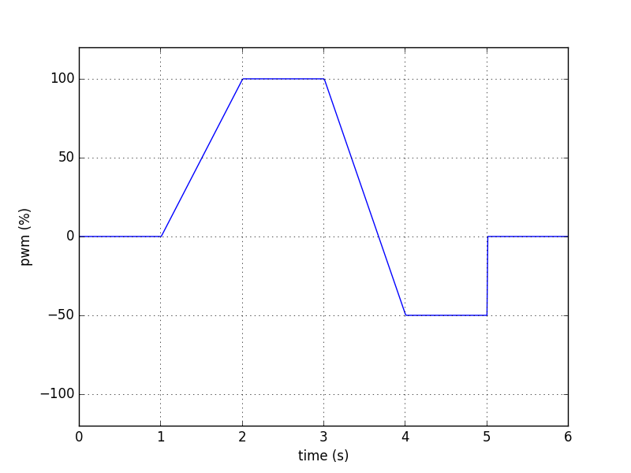
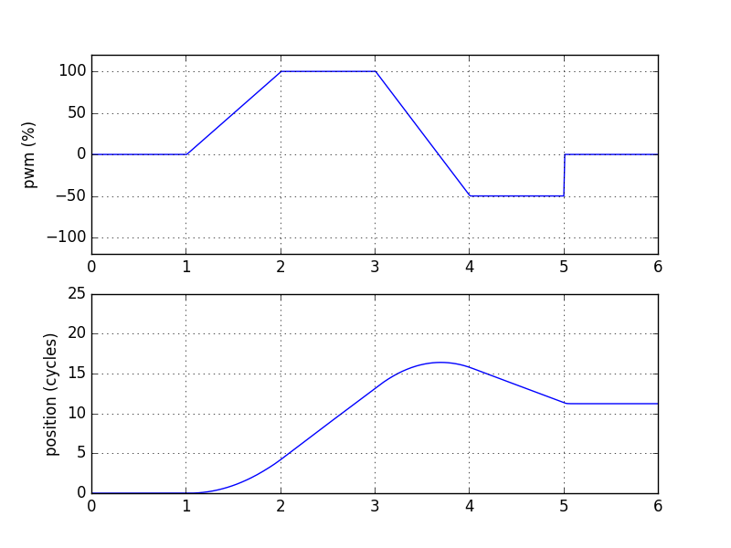
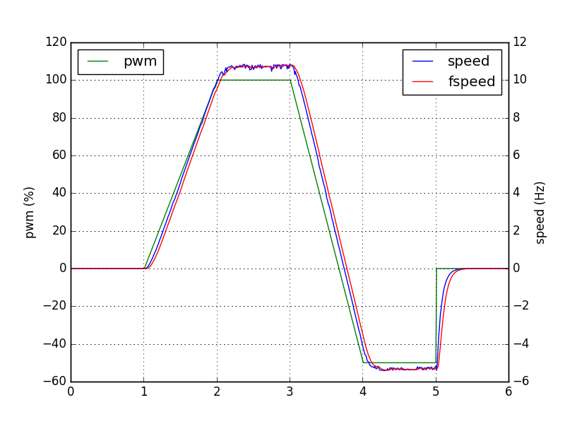
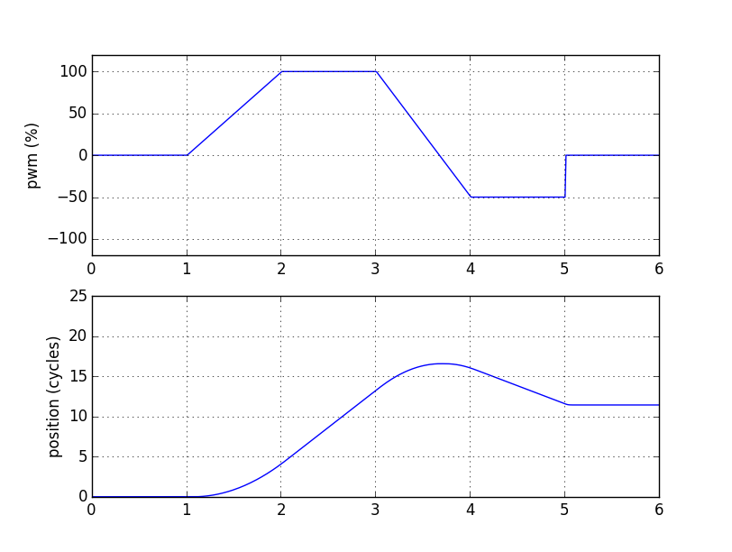
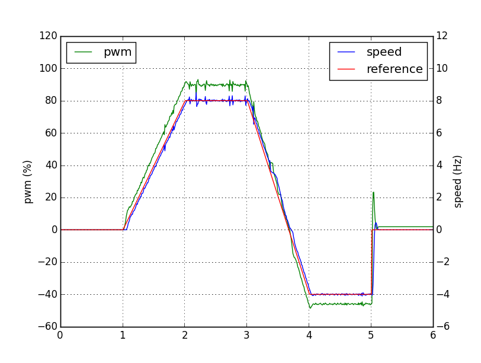

========
Tutorial
========

In this tutorial you will learn how to use Controllers, work with
*signals* and the various *blocks* available with the package
:py:mod:`ctrl`. You will also learn how to implement controllers that interact
with hardware devices. You can run the code in this tutorial
interactively using the python interpreter or by running them as
scripts. All code is available in the Section :ref:`Examples`.

--------------
Hello World!
--------------

Start with the following simple *Hello World!* example::

    # import Python's standard time module
    import time

    # import Controller and other blocks from modules
    from ctrl import Controller
    from ctrl.block import Printer
    from ctrl.block.clock import TimerClock

    # initialize controller
    hello = Controller()
    
    # add the signal myclock
    hello.add_signal('myclock')
    
    # add a TimerClock as a source
    hello.add_source('myclock',
		     TimerClock(period = 1),
		     ['myclock'])

    # add a Printer as a sink
    hello.add_sink('message',
		   Printer(message = 'Hello World!'),
		   ['myclock'])

    try:
        # run the controller
        with hello:
	    # do nothing for 5 seconds
	    time.sleep(5)

    except KeyboardInterrupt:
        pass

    finally:
        # disable Printer and TimerClock
        hello.set_sink('message', enabled = False)
        hello.set_source('myclock', enabled = False)

Depending on the platform you're running this program will print the
message *Hello World!* on the screen 4 or 5 times. The complete
program is in :ref:`hello_world.py`. You might see some warnings about
existing *signals* and *sources* which can be safely disregarded at
this stage.

----------------
What's going on?
----------------

Let's analyze each part of the above code to make sense of what is
going on. The first couple lines import the modules to be used from
the standard Python's :py:class:`time` and various :py:mod:`ctrl` libraries::

    import time
    from ctrl import Controller
    from ctrl.block import Printer
    from ctrl.block.clock import TimerClock

After importing :py:class:`Controller` you can initialize the Python
variable :py:data:`hello` as being a :py:class:`Controller`, more specifically an instance of the class :py:class:`ctrl.Controller`::
    
    hello = Controller()

A :py:class:`ctrl.Controller`, by itself, does nothing useful, so let's add some
*signals* and *blocks* that you can interact with. The line::

    hello.add_signal('myclock')

adds the *signal* :py:data:`myclock`. 

A *signal* holds a numeric scalar or vector and is used to
communicate between *blocks*. The next lines::
    
    hello.add_source('myclock',
		     TimerClock(period = 1),
		     ['myclock'])

add a :py:class:`TimerClock` as a *source*. A *source* is a type of
block that produces at least one *output* and has *no inputs*.

The parameters to :py:meth:`ctrl.Controller.add_source` are a *label*,
in this case :py:data:`myclock`, a :py:mod:`ctrl.block` object, in this
case :py:class:`ctrl.block.clock.TimerClock`, and a *list of signal outputs*, in this
case the list containg a single *signal* :py:data:`['myclock']`. 

An instance of the class :py:class:`ctrl.block.clock.TimerClock`
implements a clock based on Python's :py:class:`threading.Timer`
class. It's performance and accuracy can vary depending on the
particular implementation for your platform. The parameter
:py:attr:`period = 1` passed to :py:class:`TimerClock` means that the
*source* :py:data:`myclock` will write to the *signal*
:py:data:`myclock` a time stamp every `1` second.

The following line::

    hello.add_sink('message',
		   Printer(message = 'Hello World!'),
		   ['myclock'])

adds a :py:class:`ctrl.block.Printer` as a *sink*. A *sink* is a type
of block that takes at least one *input* but produces *no output*.

The parameters to :py:meth:`ctrl.Controller.add_sink` are a *label*,
in this case :py:data:`'message'`, a :py:mod:`ctrl.block` object, in this
case :py:class:`ctrl.block.Printer`, and a *list of inputs*, in this case
:py:data:`['myclock']`.
		   
An instance of the class :py:class:`ctrl.block.Printer` implements a
*sink* that prints messages and the signals appearing at its input. In
this case, the attribute :py:attr:`message = 'Hello World!'` is the
message to be printed.

Having created a *source* and a *sink* you are ready to run the controller::

  with hello:
      # do nothing for 5 seconds
      time.sleep(5)

Python's :py:obj:`with` statement automatically *start* and *stop* the
controller. Inside the :py:obj:`with`, the statement
:samp:`time.sleep(5)` pauses the program for 5 seconds to let the
controller run its loop and print `Hello World!` about 5 times. The
actual number of times depends on the accuracy of the timer in your
platform. Pause for 5.1 seconds instead if you would like to make sure it is printed exactly 5 times.

Secretly behind the statement :samp:`with hello` is a call to the
pair of methods :py:meth:`ctrl.Controller.start` and
:py:meth:`ctrl.Controller.stop`. In fact, alternatively, one could have
written the not so clean::

    hello.start()
    # do nothing for 5 seconds
    time.sleep(5)
    hello.stop()

Note that you should enclose the controller action inside a Python :py:obj:`try` block::

    try:
        # run the controller
        with hello:
	    # do other things
	    pass
    
    except KeyboardInterrupt:
        pass

    finally:
        # disable Printer and TimerClock
        hello.set_sink('message', enabled = False)
        hello.set_source('myclock', enabled = False)
	
This construction allows the controller to be stopped in a predictable
way. Under the hood, the controller is run using multiple `threads <https://en.wikipedia.org/wiki/Thread_(computing)>`_, which have a life of their own and can be tricky to stop. The :py:obj:`finally` statement makes sure that the clock :py:data:`myclock` is stopped by calling::

  hello.set_source('myclock', enabled = False)

Otherwise, the clock would continue to run even as the program
terminates, most likely locking your terminal, which is not the
desired behavior you're after in your first example.

The method :py:meth:`ctrl.Controller.set_source` allows you to set up
attributes of your *source*, in the case the :py:data:`enabled`
attribute that effectively stops the clock. Likewise,
:py:meth:`ctrl.Controller.set_sink` and
:py:meth:`ctrl.Controller.set_filter` allow you to set up attributes in *sinks* and *filters*.

-------------------
The controller loop
-------------------

In order to understand what is going on on behind the scenes you can
probe the contents of the variable :py:data:`hello`. For
example, after running the code in :ref:`Hello World!` a call to::

    print(hello)

produces the output:

.. code-block:: none

    > Controller with 0 device(s), 4 signal(s), 1 source(s), 1 sink(s), and 0 filter(s)

For more information you can use the method
:py:meth:`ctrl.Controller.info`. For example::

    print(hello.info('all'))

produces the output:

.. code-block:: none

    > Controller with 0 device(s), 4 signal(s), 1 source(s), 0 filter(s), 1 sink(s), and 0 timer(s)
    > devices
    > signals
      1. clock
      2. duty
      3. is_running
      4. myclock
    > sources
      1. myclock[TimerClock, enabled] >> myclock
    > filters
    > sinks
      1. myclock >> message[Printer, enabled]
    > timers

which details the *devices*, *signals*, *sources*, *filters*, *sinks*,
and *timers* present in the controller :py:data:`hello`. Of course the
*signals*, *sources* and *sinks* correspond to the ones you have added
earlier. Three additional signals, :py:data:`clock`, :py:data:`duty`
and :py:data:`is_running`. Those are always present and will be
described later.

Note also that the relationship between *sources* and *sinks* with
*signals* is indicated by a double arrow :samp:`>>`. In this case, the
*source* :py:data:`myclock` outputs to the *signal* :py:data:`myclock` and
the *sink* :py:data:`message` has as input the same *signal*
:py:data:`myclock`.

Starting the controller :py:data:`hello` with the statement
:py:obj:`with` or :py:meth:`ctrl.Controller.start` fires up the
following sequence of events:

1. Every *source* is *read* and its outputs are copied to the
   *signals* connected to the *output* of the *source*. This process
   is repeated sequentially for every *source* which is in the state
   :py:data:`enabled` until all *sources* have run once.

2. For each *filter*, the input signals are *written* to the *filter*
   that is then *read* and its outputs are copied to the *signals*
   connected to the *output* of the *filter*. This process is repeated
   sequentially for every *filter* which is in the state
   :py:data:`enabled` until all *filters* have run once.

3. The input signals of every *sink* are *written* to the *sink*. This
   process is repeated sequentially for every *sink* which is in the
   state :py:data:`enabled` until all *sinks* have run once.

4. If the *signal* :py:data:`is_running` is still `True` go back to
   step 1, otherwise stop.

The *signal* :py:data:`is_running` can be set to `False` by calling 
:py:meth:`ctrl.Controller.stop` or exiting the :py:obj:`with`
statement. In the `Hello World!` example this is done after doing
nothing for 5 seconds inside the :py:obj:`with` statement.

Note that the *flow* of *signals* is established by adding *sources*,
*filters*, and *sinks*, which are processed according to the above
loop.

Note also that the content of the input signals is made available to
the *filters* and *sinks*. To see this replace the sink
:py:data:`message` by::

    hello.add_sink('message',
		   Printer(message = 'Hello World @ {:3.1f} s'),
		   ['clock'])

and run the controller to see a message that now prints the *signal*
:py:data:`clock` along with the `Hello World` message. The format
`{:3.1f}` is used as in Python's :py:func:`format` `method <https://docs.python.org/3.4/library/functions.html#format>`_. More
than one *signal* can be printed by specifying multiple placeholders
in the attribute :py:attr:`message`.

-----------------------
Devices and Controllers
-----------------------

As you might have suspect after going through the :ref:`Hello World!`
example, it is useful to have a controller with a clock. In fact, as
you will learn later in :ref:`Timers`, every
:py:class:`ctrl.Controller` comes equipped with some kind of
clock. The method :py:meth:`ctrl.Controller.add_device` automates the
process of adding blocks to a controller and is typically used when
adding blocks that should behave as hardware devices, like a
clock. For example, the following code::

  from ctrl import Controller

  controller = Controller()
  clock = controller.add_device('clock',
                                'ctrl.block.clock', 'TimerClock',
				type = 'source', 
				outputs = ['clock'],
				enable = True,
				period = self.period)

automatically creates a :py:class:`ctrl.block.clock.TimerClock` which
is added to :py:data:`controller` as the *source* labeled
:py:data:`clock` with *output signal* :py:data:`clock`. Setting the
attribute :py:data:`enable` equal to `True` makes sure that the device
is *enabled* at every call to :py:meth:`ctrl.Controller.start` and *disabled* at
every call to :py:meth:`ctrl.Controller.stop`.

A controller with a timer based clock is so common that the above
construction is provided as a module in :py:mod:`ctrl.timer`. Using
:py:mod:`ctrl.timer` the `Hello World!` example can be simplified to::

    # import Python's standard time module
    import time

    # import Controller and other blocks from modules
    from ctrl.timer import Controller
    from ctrl.block import Printer

    # initialize controller
    hello = Controller(period = 1)
    
    # add a Printer as a sink
    hello.add_sink('message',
		   Printer(message = 'Hello World @ {:3.1f} s'),
		   ['clock'])

    try:
        # run the controller
        with hello:
	    # do nothing for 5 seconds
	    time.sleep(5)
            hello.set_sink('message', enabled = False)

    except KeyboardInterrupt:
        pass

The complete code is in :ref:`hello_timer_1.py`. Note that you no
longer have to disable the `clock` *source*, which is handled
automatically when exiting the :py:obj:`with` statement by calling
:py:meth:`ctrl.Controller.stop`. However, disabling the clock causes
an additional clock read, which would print one extra message on the
screen. This is avoided by calling::

  hello.set_sink('message', enabled = False)

to disable the *sink* :py:data:`message` right before exiting the
:py:obj:`with` statement.

A call to :samp:`print(hello.info('all'))`:

.. code-block:: none
	       
    > Controller with 1 device(s), 3 signal(s), 1 source(s), 0 filter(s), 1 sink(s), and 0 timer(s)
    > devices
      1. clock[source]
    > signals
      1. clock
      2. duty
      3. is_running
    > sources
      1. clock[TimerClock, enabled] >> clock
    > filters
    > sinks
      1. clock >> message[Printer, enabled]
    > timers

reveals the presence of the signal :py:data:`clock` and the *device*
:py:class:`ctrl.block.clock.TimerClock` as a *source*.

The notion of *device* is much more than a simple convenience
though. By having the controller dynamically initialize a block by
providing the module and class names as strings to
:py:meth:`ctrl.Controller.add_device`, i.e. the arguments
:py:data:`'ctrl.block.clock'` and :py:data:`'TimerClock'` above, it
will be possible to remotely initialize blocks that rely on the
presence of specific hardware using our :ref:`Client Server
Architecture`, as you will learn later.

In some situations it might be helpful to be able to reset a
controller to its original configuration. This can be done using the
method :py:meth:`ctrl.Controller.reset`. For example, after
initialization or a call to :py:meth:`ctrl.timer.Controller.reset`,
:samp:`print(hello.info('all'))` returns:

.. code-block:: none
	       
    > Controller with 1 device(s), 3 signal(s), 1 source(s), 0 filter(s), 0 sink(s), and 0 timer(s)
    > devices
      1. clock[source]
    > signals
      1. clock
      2. duty
      3. is_running
    > sources
      1. clock[TimerClock, enabled] >> clock
    > filters
    > sinks
    > timers

which shows the presence of the *source* :py:data:`clock` and the
*signal* :py:data:`clock` but no other *source*, *filter*, *sink*, or
*timer* added after the controller's creation.

------
Timers
------

As you have learned so far, all *sources*, *filters*, and *sinks* are
continually processed in a loop. In the above example you have
equipped the controller with a
:py:class:`ctrl.block.timer.TimerClock`, either explicitly, as in
:ref:`Hello World!`, or implicitly, by loading
:py:class:`ctrl.timer.Controller`. Note that the controller itself has
no notion of time and that events happen periodically simply because
of the presence of a :py:class:`ctrl.block.clock.TimerClock`, which
will stop processing until the set period has elapsed. In fact, the
base class :py:class:`ctrl.timer.Controller` is also equipped with a
clock *source* except that this clock does not attempt to interrupt
processing, but simply writes the current time into the *signal*
:py:data:`clock` every time the controller loop is restarted. A
controller with such clock runs as fast as possible.

For example, the code::

    # import Python's standard time module
    import time

    # import Controller and other blocks from modules
    from ctrl import Controller
    from ctrl.block import Printer

    # initialize controller
    hello = Controller()

    # add a Printer as a sink
    hello.add_sink('message',
		    Printer(message = 'Current time {:5.3f} s',
		            endln = '\r'),
		    ['clock'])
    
    try:

        # run the controller
        with hello:
	    # do nothing for 5 seconds
            time.sleep(5)

    except KeyboardInterrupt:
        pass

will print the current time with 3 decimals as fast as possible on the
screen. The additional attribute :py:data:`endl = '\\r'` introduces a
carriage return without a line-feed so that the printing happens in a
single terminal line. Now suppose that you still want to print the
:ref:`Hello World!` message every second. You can achieve this using
*timers*. Simply add the following snippet before running the
controller::
	
    
    # add a Printer as a timer
    hello.add_timer('message',
		    Printer(message = 'Hello World @ {:3.1f} s '),
		    ['clock'], None,
                    period = 1, repeat = True)

to see the `Hello World` message printing every second as the main
loop prints the `Current time` message as fast as possible. The
parameters of the method :py:meth:`ctrl.Controller.add_timer` are the
*label* and *block*, in the case :py:data:`'message'` and the
:py:class:`ctrl.block.Printer` object, followed by a *list of signal inputs*, in
this case :py:data:`['clock']`, and a *list of signal outputs*, in
this case :py:data:`None`, then the *timer* period in seconds, and a
flag to tell whether the execution of the *block* should repeat
periodically, as opposed to just once.

An example of a useful *timer* event to be run only once is the following::

    from ctrl.block import Constant
    
    # Add a timer to stop the controller
    hello.add_timer('stop',
		    Constant(value = 0),
		    None, ['is_running'],
                    period = 5, repeat = False)

which will stop the controller after 5 seconds by setting the *signal*
:py:data:`is_running` to zero. In fact, after adding the above timer
one could run the controller loop by simply waiting for the controller
to terminate using :py:meth:`ctrl.Controller.join` as in::

    with hello:
        hello.join()

Note that your program will not terminate until all *blocks* and
*timers* terminate, so it is still important that you always call
:py:meth:`ctrl.Controller.stop` or use the :py:obj:`with` statement to
exit cleanly.

A complete example with all the ideas discussed above can be found in
:ref:`hello_timer_2.py`.

-------
Filters
-------

So far you have used only *sources*, like
:py:class:`ctrl.block.clock.TimerClock`, and *sinks*, like
:py:class:`ctrl.block.Printer`. *Sources* produce outputs and take no
input and *sinks* take inputs but produce no output. *Filters* take
inputs *and* produce outputs. Your first *filter* will be used to
construct a signal which you will later apply to a motor. Consider the
following code::

    # import Controller and other blocks from modules
    from ctrl.timer import Controller
    from ctrl.block import Interp, Constant, Printer

    # initialize controller
    Ts = 0.1
    hello = Controller(period = Ts)

    # add motor signals
    hello.add_signal('pwm')

    # build interpolated input signal
    ts = [0, 1, 2,   3,   4,   5,   5, 6]
    us = [0, 0, 100, 100, -50, -50, 0, 0]
    
    # add filter to interpolate data
    hello.add_filter('input',
		     Interp(signal = us, time = ts),
		     ['clock'],
		     ['pwm'])

    # add logger
    hello.add_sink('printer',
                   Printer(message = 'time = {:3.1f} s, motor = {:+6.1f} %',
                           endln = '\r'),
                   ['clock','pwm'])

    # Add a timer to stop the controller
    hello.add_timer('stop',
		    Constant(value = 0),
		    None, ['is_running'],
                    period = 6, repeat = False)
    
    try:

        # run the controller
        with hello:
            hello.join()
            
    except KeyboardInterrupt:
        pass

    finally:
        pass

As you learned before, the *sink* :py:data:`printer` will print the
time *signal* :py:data:`clock` and the value of the *signal*
:py:data:`pwm` on the screen, and the *timer* :py:data:`stop` will
shutdown the controller after 6 seconds. The new block here is the
*filter* :py:data:`input`, which uses the block
:py:class:`ctrl.block.Interp`. This block will take as input the time
given by the *signal* :py:data:`clock` and produce as a result a value
that interpolates the values given in the arrays :py:data:`ts` and
:py:data:`us`. Internally it uses :py:func:`numpy.interp`
function. See `the numpy documentation
<https://docs.scipy.org/doc/numpy/reference/generated/numpy.interp.html>`_
for details. The reason for the name :py:data:`pwm` will be explained
later in Section :ref:`Simulated motor example`.

The key aspect in this example is how *filters* process
*signals*. This can be visualized by calling
:samp:`print(hello.info('all'))`:

.. code-block:: none
	       
    > Controller with 1 device(s), 4 signal(s), 1 source(s), 1 filter(s), 1 sink(s), and 1 timer(s)
    > devices
      1. clock[source]
    > signals
      1. clock
      2. duty
      3. is_running
      4. motor
    > sources
      1. clock[TimerClock, enabled] >> clock
    > filters
      1. clock >> input[Interp, enabled] >> pwm
    > sinks
      1. clock, pwm >> printer[Printer, enabled]
    > timers
      1. stop[Constant, period = 6, enabled] >> is_running
      
where you can see the relationship between the inputs and outputs
*signals* indicated by a pair of arrows :samp:`>>` coming in *and* out
of the the *filter* :py:data:`input`. The complete code can be found
in :ref:`hello_filter_1.py`.

-----------------
Working with data
-----------------

So far you have been running blocks and displaying the results on your
screen using :py:class:`ctrl.block.Printer`. If you would want to
store the generated data for further processing you should instead use
the block :py:class:`ctrl.block.Logger`. Let us revisit the example
from Section :ref:`Filters`, this time adding also a
:py:class:`ctrl.block.Logger`. The only difference is the introduction
of the additional *sink*::

    from ctrl.block import Logger
    
    # add logger
    hello.add_sink('logger',
                   Logger(),
                   ['clock','pwm'])

A complete example can be found in :ref:`hello_filter_2.py`. Once the
controller has run, you can then retrieve all generated data by
reading from the *sink* :py:data:`logger`. Note that :py:data:`logger`
was read by the controller loop since it is a *sink*. However, you can
sometimes read from *sinks* or write to *sources* in order to retrieve
or set data as in this case. For example::

    # retrieve data from logger
    data = hello.read_sink('logger')

retrieves the data stored in :py:data:`logger` and copy it to
the numpy array :py:data:`data`. Data is stored by rows, with each
column representing one of the signals used as inputs to the
:py:class:`ctrl.block.Logger`. In this case, the first column will
contain the signal :py:data:`clock` and the second column will contain
the signal :py:data:`pwm`. One can use standard numpy indexing
to conveniently access the data::

    clock = data[:,0]
    motor = data[:,1]

Since this is Python, you can now do whatever you please with the
data. For example you can use `matplotlib <http://matplotlib.org>`_ to
plot the data::

    # import matplotlib
    import matplotlib.pyplot as plt
    
    # start plot
    plt.figure()
        
    # plot input 
    plt.plot(clock, motor, 'b')
    plt.ylabel('motor (%)')
    plt.xlabel('time (s)')
    plt.ylim((-120,120))
    plt.xlim(0,6)
    plt.grid()
    
    # show plots
    plt.show()

The above snippet should produce a plot like the one below:

from which you can visualize the input signal :py:data:`pwm`
constructed by the :py:class:`ctrl.block.Interp` block. Note that for
better granularity the sampling period used in
:ref:`hello_filter_2.py` is 0.01 s, whereas the one used in
:ref:`hello_filter_1.py` was only 0.1 s.
     
-----------------------
Simulated motor example
-----------------------

You will now work on a more sophisticated example, in which you will
combine various filters to produce a simulated model of a
DC-motor. The complete code is in :ref:`simulated_motor_1.py`.

The beginnig of the code is similar to :ref:`hello_filter_2.py`::
  
    # import Controller and other blocks from modules
    from ctrl.timer import Controller
    from ctrl.block import Interp, Logger, Constant
    from ctrl.system.tf import DTTF, LPF

    # initialize controller
    Ts = 0.01
    simotor = Controller(period = Ts)

    # build interpolated input signal
    ts = [0, 1, 2,   3,   4,   5,   5, 6]
    us = [0, 0, 100, 100, -50, -50, 0, 0]
    
    # add motor signal
    simotor.add_signal('pwm')
    
    # add filter to interpolate data
    simotor.add_filter('input',
		       Interp(signal = us, time = ts),
		       ['clock'],
                       ['pwm'])

Note that you will be simulating this motor with a sampling period of
0.01 seconds, that is, a sampling frequency of 100 Hz. The model you
will use for the DC-motor is based on the diffential equation model:

.. math::

   \tau \ddot{\theta} + \dot{\theta} = g u

where :math:`u` is the motor input voltage, :math:`\theta` is the
motor angular displacement, and :math:`g` and :math:`\tau` are
constants related to the motor physical parameters. The constant
:math:`g` is the *gain* of the motor, which relates the steady-state
velocity achieved by the motor in response to a constant input
voltage, and the constant :math:`\tau` is the time constant of the
motor, which is a measure of how fast the motor respond to changes in
its inputs. **If you have no idea of what's going on here, keep calm
and read on! You do not need to understand all the details to be able to
use this model.**

Without getting into details, in order to simulate this differential
equation you will first convert the above model in the following
discrete-time difference equation:

.. math::

   \theta_k - (1 + c) \theta_{k-1} + c \theta_{k-2} = \frac{g T_s (1 - c)}{2} \left ( u_{k-1} + u_{k-2} \right ), \quad c = e^{-\frac{T_s}{\tau}}

where :math:`T_s` is the sampling period. It is this equation that you
will simulate by creating the following *filter*::

    from ctrl.block.system import System
    from ctrl.system.tf import DTTF

    # Motor model parameters
    tau = 1/55   # time constant (s)
    g = 0.092     # gain (cycles/sec duty)
    c = math.exp(-Ts/tau)
    d = (g*Ts)*(1-c)/2

    # add motor signals
    simotor.add_signal('encoder')

    # add motor filter
    simotor.add_filter('motor',
                       System(model = DTTF( 
                           numpy.array((0, d, d)), 
                           numpy.array((1, -(1 + c), c)))),
                       ['pwm'],
                       ['encoder'])

The input signal to the *filter* :py:data:`motor` is the *signal*
:py:data:`pwm`, which is the signal that receives the interpolated
input data you created earlier. The ouput of the *filter*
:py:data:`motor` is the *signal* :py:data:`encoder`, which corresponds
to the motor angular position :math:`\theta`.
		       
Note that the *block* used in the *filter* :py:data:`motor` is of the
class :py:class:`ctrl.block.system.System`, which allows one to
incorporate a variety of system models into filters. See :ref:`Package
ctrl.system` for other types of system models available. The
particular model you are using is a :py:class:`ctrl.system.DTTF`, in
which DTTF stands for *Discrete-Time Transfer-Function*. This model
corresponds to the difference equation discussed above.

To wrap it up you will add a *sink* :py:class:`ctrl.block.Logger` to
collect the data generated during the simulation and a *timer* to stop
the controller::

    # add logger
    simotor.add_sink('logger',
                     Logger(),
                     ['clock','pwm','encoder'])
    
    # Add a timer to stop the controller
    simotor.add_timer('stop',
		      Constant(value = 0),
		      None, ['is_running'],
                      period = 6, repeat = False)
    
As usual, the simulation is run with::
		      
  # run the controller
  with simotor:
      simotor.join()
            
After running the simulation you can read the data collected by the logger::

    # read logger
    data = simotor.read_sink('logger')
    clock = data[:,0]
    pwm = data[:,1]
    encoder = data[:,2]

and plot the results using `matplotlib <http://matplotlib.org>`_::
  
    # import matplotlib
    import matplotlib.pyplot as plt
    
    # start plot
    plt.figure()
    
    # plot input 
    plt.subplot(2,1,1)
    plt.plot(clock, pwm, 'b')
    plt.ylabel('pwm (%)')
    plt.ylim((-120,120))
    plt.xlim(0,6)
    plt.grid()
    
    # plot position
    plt.subplot(2,1,2)
    plt.plot(clock, encoder,'b')
    plt.ylabel('position (cycles)')
    plt.ylim((0,25))
    plt.xlim(0,6)
    plt.grid()
    
    # show plots
    plt.show()

to obtain a plot similar to the one below:

where you can visualize both the motor input signal :py:data:`pwm`
and the motor output signal :py:data:`encoder`, which predicts that
the motor will stop at about 13 cycles (revolutions) from its original
position if the input signal :py:data:`pwm` were applied at its
input.

The above setup is one that corresponds to a typical microcontroller
interface to a DC-motor, in which the motor voltage is controlled
through a `PWM (Pulse-Width-Modulation)
<https://en.wikipedia.org/wiki/Pulse-width_modulation>`_ signal
ranging from 0-100% of the pulse duty-cycle (with negative values
indicating a reversal in voltage polarity), and the motor position is
read using an encoder. In this situation, one might need to calculate
the motor *velocity* from the measured position. You will do that now
by adding a couple more filters to the simulated motor model. The
complete code can be found in :ref:`simulated_motor_2.py`.

After introducing *filters* to produce the *signals* :py:data:`pwm`
and :py:data:`encoder`, you will add another filter to calculate the
speed by *differentiating* the :py:data:`encoder` *signal*::

    from ctrl.block.system import Differentiator
    
    # add motor speed signal
    simotor.add_signal('speed')
    
    # add motor speed filter
    simotor.add_filter('speed',
                       Differentiator(),
                       ['clock','encoder'],
                       ['speed'])

The *filter* :py:data:`speed` uses a block
:py:class:`ctrl.block.system.Differentiator` that takes as input both
the :py:data:`clock` signal and the *signal* :py:data:`encoder`, which
is the one being differentiated, and produces the output *signal*
:py:data:`speed`.
		       
Differentiating a *signal* is always a risky proposition, and should
be avoided whenever possible. Even in this simulated environment,
small variations in the clock period and in the underlying
floating-point calculations will give rise to noise in the *signal*
:py:data:`speed`. In some cases one can get around by filtering the
*signal*. For example, by introducing a *low-pass filter* as in::
    
    from ctrl.system.tf import LPF
    
    # add low-pass signal
    simotor.add_signal('fspeed')
    
    # add low-pass filter
    simotor.add_filter('LPF',
                       System(model = LPF(fc = 5, period = Ts)),
                       ['speed'],
                       ['fspeed'])

The *filter* :py:data:`LPF` uses a block
:py:class:`ctrl.block.system.System` that takes as input the
:py:data:`speeed` signal and produces the output *signal*
:py:data:`fspeed`, which is the filtered version of the input
:py:data:`speeed`. The model used in
:py:class:`ctrl.block.system.System` is the low-pass filter
:py:class:`ctrl.system.tf.LPF` with cutoff frequency :py:data:`fc` equal
to 5 Hz.

Finally collect all the data in the logger::
		       
    # add logger
    simotor.add_sink('logger',
                     Logger(),
                     ['clock','pwm','encoder','speed','fspeed'])

After all that you should have a controller with the following blocks:

.. code-block:: none

    > Controller with 1 device(s), 6 signal(s), 1 source(s), 4 filter(s), 1 sink(s), and 1 timer(s)
    > devices
      1. clock[source]
    > signals
      1. clock
      2. duty
      3. encoder
      4. fspeed
      5. is_running
      6. speed
    > sources
      1. clock[TimerClock, enabled] >> clock
    > filters
      1. clock >> input[Interp, enabled] >> pwm
      2. pwm >> motor[System, enabled] >> encoder
      3. clock, encoder >> speed[Differentiator, enabled] >> speed
      4. speed >> LPF[System, enabled] >> fspeed
    > sinks
      1. clock, pwm, encoder, speed, fspeed >> logger[Logger, enabled]
    > timers
      1. stop[Constant, period = 6, enabled] >> is_running

Note how the order of the *filters* is important. Output that is
needed as input for other filters must be computed first if they are
to be applied *in the same iteration* of the controller
loop. Otherwise, their update values will only be applied on the next
iteration. That would be the case, for example, if you had inverted
the order of the *filters* :py:data:`motor` and :py:data:`speed` as
in:

.. code-block:: none

    > filters
      1. clock >> input[Interp, enabled] >> pwm
      2. clock, encoder >> speed[Differentiator, enabled] >> speed
      3. pwm >> motor[System, enabled] >> encoder
      4. speed >> LPF[System, enabled] >> fspeed

which would make the *filter* :py:data:`speed` always see the input
*signal* :py:data:`encoder` as calculated in the previous loop
iteration. Note how this would also affect the input to the *filter*
:py:data:`LPF`!

Running :ref:`simulated_motor_2.py` produces a plot similar to the one shown below:

where you can simultaneously visualize the *signal* :py:data:`pwm`,
the *signal* :py:data:`speed` as calculated by the
differentiator, and the filtered speed *signal* :py:data:`fspeed`.
	   
-------------------------
Interfacing with hardware
-------------------------

In this section you will learn how to interface with real hardware. Of
course you can only run the examples in this section if you have the
appropriate hardware equipment.

Before you begin
----------------

For demonstration purposes it will be assumed that you have an
`Educational MIP (Mobile Inverted Pendulum) kit
<https://github.com/StrawsonDesign/EduMiP>`_ with a `Beaglebone Black
<https://beagleboard.org/black>`_ equipped with a `Robotics Cape
<http://www.strawsondesign.com/>`_ or a `Beaglebone Blue
<https://beagleboard.org/blue>`_. You may have to download additional
`libraries
<https://github.com/StrawsonDesign/Robotics_Cape_Installer>`_ and the
`rcpy package <https://github.com/mcdeoliveira/rcpy>`_. See Section
:ref:`Installation` for details.

**Make sure that all required software is installed and working before
proceeding. Consult the documentation provided in the links above and
the Section** :ref:`Installation` **for more details.**

Installing devices
------------------

Before you can interact with hardware you have to install the
appropriate devices. The following code will initialize a controller
that can interface with the `Robotics Cape
<http://www.strawsondesign.com/>`_::
   
    # import Controller and other blocks from modules
    from ctrl.rc import Controller

    # initialize controller
    Ts = 0.01
    bbb = Controller(period = Ts)

Note that the code is virtually the same as used before except that
you are importing `Controller` from :py:mod:`ctrl.rc` rather than from
:py:mod:`ctrl` or :py:mod:`ctrl.timer`. It is now time to install the
devices you will be using. For this demonstration you will use one of
the `MIP's <https://github.com/StrawsonDesign/EduMiP>`_ motor and the corresponding encoder. First load the
encoder::
   
    # add encoder as source
    bbb.add_device('encoder1',
                   'ctrl.rc.encoder', 'Encoder',
                   type = 'source',
                   outputs = ['encoder'],
                   encoder = 3, 
                   ratio = 60 * 35.557)

which will appear as a *source* labeled :py:data:`encoder1` connected
to the output *signal* :py:data:`encoder`.

You install devices using the same method
:py:meth:`ctrl.Controller.add_device` you already worked with
before. Besides the mandatory parameters `label`, `device_module`, and
`device_class`, you have to provide the type of block the device will
be installed as, i.e. *source*, *filter*, or *sink*, and the corresponding
list of *inputs signal* and *output signals*. The remaining parameters
are specific to the device and are passed to the `device_module` and
`device_class` constructor. Each device has its own specific set of
parameters.

For example, the attribute :py:data:`encoder` is set to 3, which
selects the 3rd (out of a total of 4 available) hardware encoder
counter in the Beaglebone Black, and :py:data:`ratio` is set to 60 *
35.557 to reflect the presence of a gear box connected between the
encoder and the wheel shaft, which is the movement that you would like
the encoder to measure.  Using the above ratio, the unit of the
*signal* :py:data:`encoder` will be *cycles*, that is, one complete
turn of the wheel will add or substract one to the *signal*
:py:data:`encoder`.

You load the motor as::

    # add motor as sink
    bbb.add_device('motor1', 
                   'ctrl.rc.motor', 'Motor',
                   type = 'sink',
                   enable = True,
                   inputs = ['pwm'],
                   motor = 3)

which will appear as the *sink* :py:data:`motor1` connected to the
input *signal* :py:data:`pwm`. Note that the above code makes use of
the parameter :py:data:`enable`, which controls whether the device
should be enabled at :py:meth:`ctrl.Controller.start` and disabled at
:py:meth:`ctrl.Controller.stop`. In the case of motors or other
devices that can present danger if left in some unknown state, this is
done for safety: terminating or aborting your code will automatically
turn off the physical motor. Note that the *source*
:py:data:`encoder1` will remain enabled all the time, since there is
no danger in keeping counting your encoder pulses even when the
controller is off.

As with the encoder, the motor device takes the additional attribute
:py:data:`motor`, which selects the 3rd (out of a total of 4
available) hardware motor drivers (H-bridges) in the Robotics Cape or
Beaglebone Blue. Those are driven by the Beaglebone Black or Blue PWM
hardware generators, which in this case is controlled by the input
signal :py:data:`pwm` taking values between -100 and 100. Negative
values reverse the polarity of the voltage applied to the motor
causing a reversal in the motor direction. Note that the value of the
actual voltage applied to the motor will depend on the voltage source
connected to the Robotics Cape. In the case of the Educational MIP kit
this voltage will be approximately 7.4 V when the battery is fully
charged.

The current configuration of the controller after installing the
devices is shown in the output of :samp:`print(bbb.info('all'))`:

.. code-block:: none

    > Controller with 3 device(s), 6 signal(s), 2 source(s), 0 filter(s), 1 sink(s), and 0 timer(s)
    > devices
      1. clock[source]
      2. encoder1[source]
      3. motor1[sink]
    > signals
      1. clock
      2. duty
      3. encoder
      4. fspeed
      5. is_running
      6. speed
    > sources
      1. clock[TimerClock, enabled] >> clock
      2. encoder1[Encoder, enabled] >> encoder
    > filters
    > sinks
      1. pwm >> motor1[Motor, disabled]
    > timers

Using devices
-------------

Once hardware devices are installed as *sinks*, *filters*, or
*sources*, you can use them exactly as before. *Sensors* will usually
be installed as *sources* and *actuators* typically as *sinks*.

Because you use the same names for the signals handled by the encoder
and motor devices as the ones used in the Section
:ref:`Simulated motor example`, you can simply copy parts of that code
to repeat the motor experiment, this time using real hardware. For example,
the code::

    from ctrl.block import Interp, Logger, Constant
    from ctrl.block.system import Differentiator
    from ctrl.system.tf import LPF

    # build interpolated input signal
    ts = [0, 1, 2,   3,   4,   5,   5, 6]
    us = [0, 0, 100, 100, -50, -50, 0, 0]
    
    # add filter to interpolate data
    bbb.add_filter('input',
		   Interp(signal = us, time = ts),
		   ['clock'],
                   ['pwm'])
    
    # add motor speed signal
    bbb.add_signal('speed')
    
    # add motor speed filter
    bbb.add_filter('speed',
                   Differentiator(),
                   ['clock','encoder'],
                   ['speed'])
    
    # add low-pass signal
    bbb.add_signal('fspeed')
    
    # add low-pass filter
    bbb.add_filter('LPF',
                   System(model = LPF(fc = 5, period = Ts)),
                   ['speed'],
                   ['fspeed'])
    
    # add logger
    bbb.add_sink('logger',
                 Logger(),
                 ['clock','pwm','encoder','speed','fspeed'])
    
    # Add a timer to stop the controller
    bbb.add_timer('stop',
		  Constant(value = 0),
		  None, ['is_running'],
                  period = 6, repeat = False)

will produce a controller with the following connections:

.. code-block:: none

    > Controller with 3 device(s), 6 signal(s), 2 source(s), 3 filter(s), 2 sink(s), and 1 timer(s)
    > devices
      1. clock[source]
      2. encoder1[source]
      3. motor1[sink]
    > signals
      1. clock
      2. duty
      3. encoder
      4. fspeed
      5. is_running
      6. speed
    > sources
      1. clock[TimerClock, enabled] >> clock
      2. encoder1[Encoder, enabled] >> encoder
    > filters
      1. clock >> input[Interp, enabled] >> pwm
      2. clock, encoder >> speed[Differentiator, enabled] >> speed
      3. speed >> LPF[System, enabled] >> fspeed
    > sinks
      1. pwm >> motor1[Motor, disabled]
      2. clock, pwm, encoder, speed, fspeed >> logger[Logger, enabled]
    > timers
      1. stop[Constant, period = 6, enabled] >> is_running

You run this controller program invoking::
  
  # reset the clock
  bbb.set_source('clock', reset = True)
   
  # run the controller
  with bbb:
      bbb.join()

Note the additional step of resetting the clock before starting the
controller. Because the clock in the Robotics Cape is controlled by
hardware and runs continuously, having starting when you first
instanciated the :py:class:`ctrl.rc.Controller` object, you need to
reset the clock before starting this program so that the input
:py:data:`pwm` is properly synchronized with the hardware clock.

Upon running the complete code provided in :ref:`rc_motor.py` the
following plots are produced using matplotlib:
      

To the naked eye, the position plot above is virtually identical to
the one obtained using the simulated model from Section
:ref:`Simulated motor example`. Some subtle differences are visible in
the velocity plot below:
	   
.. image:: figures/rc_motor_2.png

where you can see that the motor has some difficulties overcoming
`stiction <https://en.wikipedia.org/wiki/Stiction>`_, that is the
static friction force that dominates when the velocities become small:
it takes a bit longer to start around 1 second and gets *stuck* again
around 4 s when the velocity comes to zero. Note also the more
pronounced noise which is amplified by the differentiator and then
attenuated by the low-pass filter.

-------------------
Closed-loop control
-------------------

The motivation to write this package is to be able to easily implement
feedback controllers. The subject is extensive and will not be covered
in any detail here. A completely unbiased and awesome reference is
[deO16]_. The treatment is suitable to undergraduates students with an
engineer and science background. **Again, do not let yourself be
intimidated by the language here, you do not need to understand all
the details to implement or, better yet, to benefit from using a
feedback controller**

Proportional-integral motor speed control
-----------------------------------------

You will now turn to the implementation of a closed-loop
proportional-integral controller using the same hardware discussed in
the Section :ref:`Interfacing with hardware`. Start by installing the
same devices as before, a motor and an encoder::

    # import Python's standard math module and numpy
    import math, numpy
    
    # import Controller and other blocks from modules
    import rc
    from ctrl.rc import Controller

    # initialize controller
    Ts = 0.01
    bbb = Controller(period = Ts)

    # add encoder as source
    bbb.add_device('encoder1',
                   'ctrl.rc.encoder', 'Encoder',
                   type = 'source',
                   outputs = ['encoder'],
                   encoder = 3, 
                   ratio = 60 * 35.557)
    
    # add motor as sink
    bbb.add_device('motor1', 
                   'ctrl.rc.motor', 'Motor',
                   type = 'sink',
                   enable = True,
                   inputs = ['pwm'],
                   motor = 3)

Because you will be controlling the motor speed, add also a differentiator::
		   
    from ctrl.block.system import Differentiator
    
    # add motor speed signal
    bbb.add_signal('speed')
    
    # add motor speed filter
    bbb.add_filter('speed',
                   Differentiator(),
                   ['clock','encoder'],
                   ['speed'])

According to the dynamic model introduced earlier in :ref:`Simulated
motor example`, the transfer-function from the PWM input, :math:`u`, to
the motor velocity, :math:`\omega = \dot{\theta}`, is:

.. math::

   G(s) = \frac{\Omega(s)}{U(s)} = \frac{g}{\tau s + 1}

You will implement a PI (Proportional-Integral) controller with
transfer-function:

.. math::

   K(s) = \frac{U(s)}{E(s)} = K_{\mathrm{p}} + \frac{K_{\mathrm{i}}}{s} = K_{\mathrm{p}} \frac{s + K_{\mathrm{i}}/K_{\mathrm{p}}}{s}

The way by which you will connect this controller to the motor is
given in the feedback block-diagram:

.. _FeedbackDiagram:

.. tikz:: [>=latex', block/.style = {
	     draw,
	     fill=blue!5,
	     rectangle,
	     rounded corners,
	     minimum height=2em,
	     minimum width=3em
	     }, sum/.style = {
	     draw, fill=blue!5, circle
	     }, node distance = 6em]
    \node [coordinate, name=input]{};
    \node [sum, right of=input,node distance = 5em](sum){};
    \node [block, right of=sum,node distance = 6em](controller){Controller};
    \node [block, right of=controller,node distance = 8em](system){Motor};
    \node [coordinate, right of=system] (output) {};
    \draw [->](input) -- node [above,pos=0.3]{$\bar{\omega}$}(sum);
    \path [->](sum) edge node[above]{$e$} (controller);
    \path [->](controller) edge node[above,name=u,pos=0.7]{$u$} (system);
    \path [->](system) edge node [above,name=y] {$\omega$}(output);
    \draw [->](y) -- ++(0,-3em) -| node[left,pos=0.9] {$-$}(sum);
    \draw [dashed,rounded corners]
            ([yshift=-4em,xshift=3.2em] input) rectangle
            ([yshift=2em,xshift=-1em] u);

*Feedback* here means that a measurement of the motor speed,
:math:`\omega`, will be compared with a reference speed,
:math:`\bar{\omega}`, to create an *error signal*, :math:`e`. When
:math:`\omega` matches :math:`\bar{\omega}` exactly then the error
signal is zero. It is the controller's job to produce a suitable pwm
input, :math:`u`, so that this is possible. The PI controller does
that by *integrating* the error. Indeed, the transfer-function of the
PI controller corresponds to:

.. math::

   u(t) = K_{\mathrm{p}} e(t) + K_{\mathrm{i}} \int_{0}^t e(\tau) \, d\tau

You can see that it is the integrator's job to *estimate* the
necessary level of motor PWM input, :math:`u`, so that the error can
be made small, in other words, so that the motor can track a desired
reference speed, :math:`\bar{\omega}`. Indeed, if the controller
succeeds in its task to keep the error signal small, that is :math:`e
= 0`, then the contribution from the proportional term,
:math:`K_{\mathrm{p}} e(t)`, will also be zero.

There's lot to be said about how to *design* suitable gains
:math:`K_{\mathrm{p}}` and :math:`K_{\mathrm{i}}` [deO16]_. Here you
will choose

.. math::

   \frac{K_{\mathrm{i}}}{K_{\mathrm{p}}} = \tau^{-1}, \quad K_{\mathrm{p}} = g^{-1}

so that the closed-loop transfer-function from :math:`\bar{\omega}` to
:math:`\omega` becomes

.. math::

   \frac{\Omega(s)}{\bar{\Omega}(s)} = \frac{G(s) K(s)}{1 + G(s) K(s)} = \frac{1}{\tau K_{\mathrm{p}}^{-1} g^{-1} s + 1} = \frac{1}{\tau s + 1}

This will make the motor respond with the same time-constant as if it
were in open-loop but this time with the ability to *track* constant a
reference velocity signal :math:`\bar{\omega}`.

Taking advantage of the blocks :py:class:`ctrl.block.system.System`
and :py:class:`ctrl.block.system.Feedback`, and of the PID control
algoritm provided in :py:class:`ctrl.system.tf.PID` you can calculate
and implement this PI controller in only a few lines of code::

    from ctrl.block.system import Feedback, System
    from ctrl.system.tf import PID
    
    # calculate PI controller gains
    tau = 1/55   # time constant (s)
    g = 0.092    # gain (cycles/sec duty)

    Kp = 1/g
    Ki = Kp/tau

    print('Controller gains: Kp = {}, Ki = {}'.format(Kp, Ki))

    # build controller block
    pid = System(model = PID(Kp = Kp, Ki = Ki, period = Ts))
    
    # add motor speed signal
    bbb.add_signal('speed_reference')

    # add controller to the loop
    bbb.add_filter('PIcontrol',
		   Feedback(block = pid),
		   ['speed','speed_reference'],
                   ['pwm'])

The block :py:class:`ctrl.block.system.Feedback` implements the
operations inside the dashed box in the :ref:`feedback diagram
<FeedbackDiagram>`. That is, it calculates the error signal,
:math:`e`, and evaluates the block given as the attribute
:py:data:`block`, in this case the
:py:class:`ctrl.block.system.System` containing as the attribute
:py:data:`model` the controller :py:class:`ctrl.system.tf.PID`.
		   
The complete code, including a reference speed that looks like
the PWM input used before to drive the motor in Sections
:ref:`Simulated motor example` and :ref:`Interfacing with hardware`,
is in the example :ref:`rc_motor_control.py`. Results obtained with
the MIP kit should look like the following plot:
		   

Note how the motor speed *tracks* the reference signal in closed-loop,
effectively calculating the required PWM input necessary for
acomplishing that. Compare this behaviour with the previous
*open-loop* graphs in which a curve similar to the reference speed was
instead applied directly to the motor PWM input. Look also for some
interesting side-effects of feedback control, such as the somwehat
smoother behavior near the points where the motor reaches zero
speed. Look for [deO16]_ for much more in depth discussions.

State-space MIP balance controller
----------------------------------

Your second feedback controller will be more sophisticated. You will
use two measurements and will be used to balance the MIP in its
upright position. More details on the modeling and design of the
controller you will implement here can be found in [Zhuo16]_. The
final controller correspond to the following feedback diagram:

.. _MIPDiagram:

.. tikz:: [>=latex', block/.style = {
	     draw,
	     fill=blue!5,
	     rectangle,
	     rounded corners,
	     minimum height=2em,
	     minimum width=3em
	     }, sum/.style = {
	     draw, fill=blue!5, circle
	     }, node distance = 6em]
    \node [coordinate, name=input]{};
    \node [sum, right of=input,node distance = 5em](sum){};
    \node [coordinate, name=sum2, above of=sum, node distance=2em]{};
    \node [block, right of=sum,node distance = 6em, minimum height=4em, yshift=1em](controller){Controller};
    \node [block, right of=controller,node distance = 8em, minimum height=6em,minimum width=4em](system){MIP};
    \node [coordinate, right of=system, yshift=-1.75em] (phi) {};
    \node [coordinate, right of=system, yshift=1.75em] (theta) {};
    \draw [->](input) -- node [above,pos=0.3]{$\bar{\dot{\phi}}$}(sum);
    \path [<-](controller) ++(-2.5em,-1em) edge node[above]{$e_{\dot{\phi}}$} (sum);
    \path [->](controller) edge node[above,name=u,pos=0.7]{$u$} (system);
    \path [->](system) ++(2em,-1.75em) edge node [above,name=y] {$\dot{\phi}$}(phi);
    \path [->](system) ++(2em,+1.75em) edge node [below,name=y2] {$\dot{\theta}$}(theta);
    \draw [->](y) -- ++(0,-3em) -| node[left,pos=0.9] {$-$}(sum);
    \draw [->](y2) -- ++(0,3em) -| (sum2) -- node[above,pos=0.7]{$-$} ++(3.5em,0);
    \draw [dashed,rounded corners]
            ([yshift=-4em,xshift=3.2em] input) rectangle
            ([yshift=4.4em,xshift=-1em] u);

in which you can see that the feedback controller makes use of two
measurements, the vertical angle velocity, :math:`\dot{\theta}`, and
the wheel angular velocity, :math:`\dot{\phi}`. It also takes in a
reference wheel angular velicity, :math:`\bar{\dot{\phi}}`, that can
be used to drive the MIP backward and forward.

As described in detail in [Zhuo16]_, the discrete-time controller,
corresponding to the block inside the dashed box in the :ref:`feedback
diagram <MIPDiagram>`, is given by discrete-time state-space model of
the form:

.. math::

   x_{k+1} &= A x_k + B y_k \\
   u_k &= C x_k + D y_k

where :math:`y_k` represents the controller input, consisting of the
measurement and error signals

.. math::

   y_k = \begin{pmatrix} \dot{\theta}_k \\ \dot{\phi}_k \\
   \bar{\dot{\phi}}_k \end{pmatrix}

and :math:`u_k` is the PWM input to be applied to both left and right
MIP motors.

Implementing this controller is very simple. First initialize the
controller as::

    # import blocks and controller
    from ctrl.rc.mip import Controller
    from ctrl.block.system import System, Subtract, Differentiator, Sum, Gain
    from ctrl.block.nl import ControlledCombination
    from ctrl.block import Logger, ShortCircuit
    from ctrl.system.ss import DTSS
  
    # create mip
    mip = Controller()

Note that you have imported the special
:py:class:`ctrl.rc.mip.Controller` class that already initializes all
devices needed for controlling the MIP. A look at :samp:`mip.info('all')`:

.. code-block:: none
		
    > Controller with 6 device(s), 9 signal(s), 4 source(s), 0 filter(s), 2 sink(s), and 0 timer(s)
    > devices
      1. inclinometer[source]
      2. clock[source]
      3. motor1[sink]
      4. motor2[sink]
      5. encoder1[source]
      6. encoder2[source]
    > signals
      1. clock
      2. duty
      3. encoder1
      4. encoder2
      5. is_running
      6. motor1
      7. motor2
      8. theta
      9. theta_dot
    > sources
      1. clock[Clock, enabled] >> clock
      2. inclinometer[Inclinometer, enabled] >> theta, theta_dot
      3. encoder1[Encoder, enabled] >> encoder1
      4. encoder2[Encoder, enabled] >> encoder2
    > filters
    > sinks
      1. motor1 >> motor1[Motor, disabled]
      2. motor2 >> motor2[Motor, disabled]
    > timers

reveals that :py:class:`ctrl.rc.mip.Controller` already installed the
following devices:

1. **a clock**;
2. **one inclinometer**, which is based on a built in giroscope and
   will be used to measure :math:`\dot{\theta}`; the inclinometer also
   produces a measurement of :math:`\theta` that is only accurate
   under small velocities and accelerations;
3. **two motors**, which give access to the two PWM signals driving
   the left and right motors of the MIP;
4. **two encoders**, which measure the relative angular displacement
   between the body of MIP and the axis of the left and right motors,
   from which you will measure :math:`\dot{\phi}`.

The angular velocity :math:`\dot{\phi}` can be obtained after
averaging the two wheel encoders and differentiating the resulting
angle :math:`\phi`::
   
    # phi is the average of the encoders
    mip.add_signal('phi')
    mip.add_filter('phi',
                   Sum(gain=0.5),
                   ['encoder1','encoder2'],
                   ['phi'])

    # phi dot
    mip.add_signal('phi_dot')
    mip.add_filter('phi_dot',
                   Differentiator(),
                   ['clock','phi'],
                   ['phi_dot'])

Also add the reference signal :math:`\bar{\dot{\phi}}`::
		   
    # phi dot reference
    mip.add_signal('phi_dot_reference')
		   
Having all signals necessary for feedback, construct and implemented
the feedack controller as follows::
   
    # state-space matrices
    A = np.array([[0.913134, 0.0363383],[-0.0692862, 0.994003]])
    B = np.array([[0.00284353, -0.000539063], [0.00162443, -0.00128745]])
    C = np.array([[-383.009, 303.07]])
    D = np.array([[-1.22015, 0]])

    B = 2*np.pi*(100/7.4)*np.hstack((-B, B[:,1:]))
    D = 2*np.pi*(100/7.4)*np.hstack((-D, D[:,1:]))

    ssctrl = DTSS(A,B,C,D)

    mip.add_signal('pwm')
    mip.add_filter('controller',
                   System(model = ssctrl),
                   ['theta_dot','phi_dot','phi_dot_reference'],
                   ['pwm'])

As a final step connect the *signal* :py:data:`pwm` to both motors
using a :py:class:`ctrl.block.ShortCircuit`::
   
    # connect to motors
    mip.add_filter('cl1',
                   ShortCircuit(),
                   ['pwm'],
                   ['motor1'])
    mip.add_filter('cl2',
                   ShortCircuit(),
                   ['pmw'],
		   ['motor2'])

The code for a complete controller with some added bells and whitles
to let you drive the MIP while balancing upright is given in
:ref:`rc_mip_balance.py`. A video of the resulting balancing
controller is available `here
<http://guitar.ucsd.edu/beaglebone/mip.mpeg>`_.

References
----------

.. [deO16] M. C. de Oliveira, *Fundamentals of Linear Control: a
           concise approach*, Cambridge University Press, 2016.

.. [Zhuo16] Zhu Zhuo, *MIP*, M.Sc. Thesis, University of California San
	    Diego, 2016.
	   
